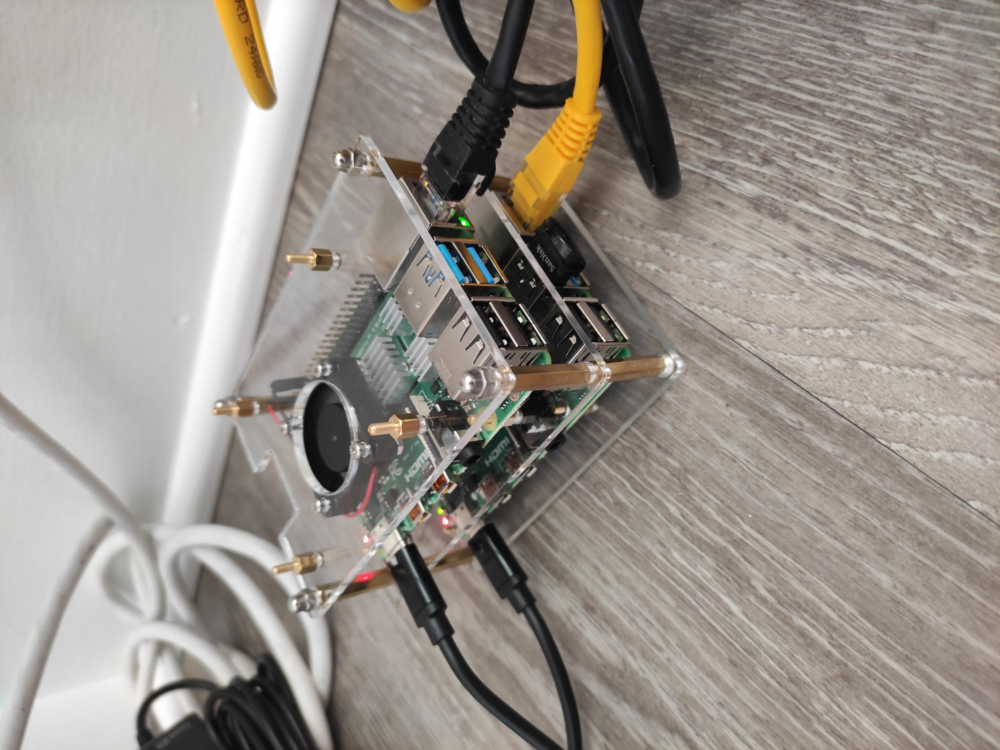

## Kubernetes (K3S) on Raspberry Pi 4



## Materials
1) 2x Raspberry Pi 4
2) 2x Official PSU
3) iUniker Raspberry Pi 4 Cluster Case
4) Sandisk USB 3.1 Ultra Fit 64GB

## Introduction
* After watching the [Kubecon talk](https://kccnceu2021.sched.com/event/iE2B/automating-your-home-with-k3s-and-home-assistant-eddie-zaneski-amazon-web-services-jeff-billimek-the-home-depot),
I decided to buy two Raspberry Pi 4 for one master node and one child node. 

## Setting up
1) Firstly, Raspberry Pi has default `raspberrypi` as their hostname, so changing the hostname will make it easier to recognize master node and children node. We can do that by editing the file `/etc/hosts` and `/etc/hostname`
```
127.0.0.1	localhost
::1		localhost ip6-localhost ip6-loopback
ff02::1		ip6-allnodes
ff02::2		ip6-allrouters

127.0.1.1	knode0
```
```
knode0
```
2) I then made sure the router's DHCP server uses the same IP address everytime it boots up by logging into the router page and edit the file `/etc/dhcpcd.conf`
```
# Example static IP configuration:
#interface eth0
#static ip_address=192.168.0.10/24
#static ip6_address=fd51:42f8:caae:d92e::ff/64
#static routers=192.168.0.1
#static domain_name_servers=192.168.0.1 8.8.8.8 fd51:42f8:caae:d92e::1

```
3）Make sure `cgroup is enabled` by editing `/boot/cmdline.txt`
```
cgroup_enable=cpuset cgroup_memory=1 cgroup_enable=memory
```
4) Reboot Raspberry Pi by doing
```
sudo reboot
```
5) I installed [arkade](https://github.com/alexellis/arkade) so that I can easily install application on my Raspberry pi

6) I used [arkade](https://github.com/alexellis/arkade) to install `kubectl` by doing 
```
arkade install kubectl
```
7) From [here](https://github.com/k3s-io/k3s/issues/3389), I know IPv6 is not supported for Flannel so I had to disable IPv6 by adding these commands to `/etc/sysctl.conf`
``` 
net.ipv6.conf.all.disable_ipv6=1
net.ipv6.conf.default.disable_ipv6=1
net.ipv6.conf.lo.disable_ipv6=1
net.ipv6.conf.eth0.disable_ipv6 = 1
```
8) To setup the master node, I followed the option bellow. The TLS san option is to allow the API server to accept the ip address as part of the client so `kubectl` to work on anywhere so you just have to configure port forwarding from your router.
```
$ export K3S_KUBECONFIG_MODE="644"
$ export INSTALL_K3S_EXEC=" --no-deploy servicelb --no-deploy traefik --tls-san xx.xx.xx.xx"
$ curl -sfL https://get.k3s.io | sh -
```
9) We can get the node token now
```
$ sudo cat /var/lib/rancher/k3s/server/node-token

K106edce2ad174510a840ff7e49680fc556f8830173773a1ec1a5dc779a83d4e35b::server:5a9b70a1f5bc02a7cf775f97fa912345
```
10) To add the worker node, copy the token obtained above and do (assume the master node IP is `192.168.0.22`)
```
$ export K3S_KUBECONFIG_MODE="644"
$ export K3S_URL="https://192.168.0.22:6443"
$ export K3S_TOKEN="K106edce2ad174510a840ff7e49680fc556f8830173773a1ec1a5dc779a83d4e35b::server:5a9b70a1f5bc02a7cf775f97fa912345"
$ curl -sfL https://get.k3s.io | sh -
```
11) Now we need to configure the `.kube/config` from your laptop so we can access the cluster from `kubectl`. I opened the `k3s.yaml` file at `/etc/rancher/k3s/k3s.yaml`  
 and copied that file to `.kube/config`. Adding the `user`, `cluster`, and `context` value (I changed from `default` to `k3s-rpi`) to the `.kube/config` file does the work
12) Last but not least, I changed the `context` from `kubectl` by doing 
```
kubectl config use-context k3s-rpi
```
13) Remember to taint the master node so no pods will be schedule on the master node
```
kubectl taint node kmaster  node-role.kubernetes.io/master:-
```
14) That's it, I have my Raspberry Pi Kubernetes Clusters running now
```
lau@debian:~ $ kubectl get nodes
NAME      STATUS   ROLES                  AGE     VERSION
knode0    Ready    <none>                 5m32s   v1.21.1+k3s1
kmaster   Ready    control-plane,master   16m     v1.21.1+k3s1
```
```
lau@debian:~ $ kubectl top node
NAME      CPU(cores)   CPU%   MEMORY(bytes)   MEMORY%   
kmaster   479m         11%    786Mi           20%       
knode0    218m         5%     298Mi           7%
```

### Update
To update, we have to update all the master nodes first and proceed to worker nodes next
You will use the same commands to update the master node
```
$ export K3S_KUBECONFIG_MODE="644"
$ export INSTALL_K3S_EXEC=" --no-deploy servicelb --no-deploy traefik --tls-san xx.xx.xx.xx"
$ curl -sfL https://get.k3s.io | sh -
```
Same as worker node
```
$ export K3S_KUBECONFIG_MODE="644"
$ export K3S_URL="https://192.168.0.22:6443"
$ export K3S_TOKEN="K106edce2ad174510a840ff7e49680fc556f8830173773a1ec1a5dc779a83d4e35b::server:5a9b70a1f5bc02a7cf775f97fa912345"
$ curl -sfL https://get.k3s.io | sh -

```
```
NAME      STATUS   ROLES                  AGE   VERSION
kmaster   Ready    control-plane,master   96d   v1.21.4+k3s1
knode0    Ready    <none>                 96d   v1.21.4+k3s1

```


## Really useful websites
* https://greg.jeanmart.me/blog/
