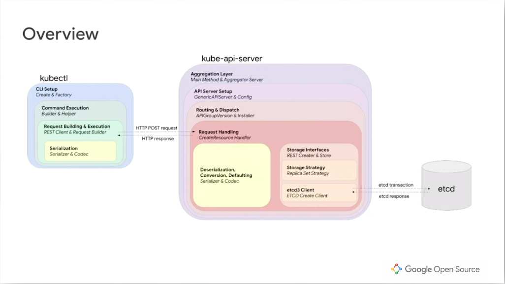

# Kubectl to API server note

## Client Side
kubectl makes HTTP POST request to kube-api-server and kube-api-server returns with HTTP response. Let's dive deep into it.   
**Kubectl POST request:**
* kubectl will use [Factory abstraction](https://github.com/kubernetes/kubernetes/blob/7cea81ce34c4aa7d0e952d7f9957db254e3fbc83/staging/src/k8s.io/kubectl/pkg/cmd/util/factory.go#L40) to execute kubectl
* Inside [Factory](https://github.com/kubernetes/kubernetes/blob/7cea81ce34c4aa7d0e952d7f9957db254e3fbc83/staging/src/k8s.io/kubectl/pkg/cmd/util/factory.go#L40) we will have a [builder](https://github.com/kubernetes/kubernetes/blob/7cea81ce34c4aa7d0e952d7f9957db254e3fbc83/staging/src/k8s.io/kubectl/pkg/cmd/util/factory.go#L54) 
* This [line](https://github.com/kubernetes/kubernetes/blob/7cea81ce34c4aa7d0e952d7f9957db254e3fbc83/staging/src/k8s.io/kubectl/pkg/cmd/create/create.go#L252) will create a [builder](https://github.com/kubernetes/kubernetes/blob/7cea81ce34c4aa7d0e952d7f9957db254e3fbc83/staging/src/k8s.io/kubectl/pkg/cmd/util/factory.go#L54) which is responsible for taking the data that pass in via `-f` flag or `-k` flags (which is usually a YAML file), unpack it and turn it into iterable list of Kubernetes Objects such that each Object will have generic REST operation performed on it.
* For each resource a [NewHelper](https://github.com/kubernetes/kubernetes/blob/7cea81ce34c4aa7d0e952d7f9957db254e3fbc83/staging/src/k8s.io/kubectl/pkg/cmd/create/create.go#L286) function will be created which will provide methods for running generic RESTful operations. This helper will have methods([Get](https://github.com/kubernetes/kubernetes/blob/7cea81ce34c4aa7d0e952d7f9957db254e3fbc83/staging/src/k8s.io/cli-runtime/pkg/resource/helper.go#L78),[POST](https://github.com/kubernetes/kubernetes/blob/7cea81ce34c4aa7d0e952d7f9957db254e3fbc83/staging/src/k8s.io/cli-runtime/pkg/resource/helper.go#L167) , etc etc)
* [Create](https://github.com/kubernetes/kubernetes/blob/7cea81ce34c4aa7d0e952d7f9957db254e3fbc83/staging/src/k8s.io/kubectl/pkg/cmd/create/create.go#L289) will then be called to create a Resource which will be done [here](https://github.com/kubernetes/kubernetes/blob/d88d9ac3b4eff86de439d65558a918a4d5fe962d/staging/src/k8s.io/cli-runtime/pkg/resource/helper.go#L166). 
* It will then make a [POST](https://github.com/kubernetes/kubernetes/blob/d88d9ac3b4eff86de439d65558a918a4d5fe962d/staging/src/k8s.io/cli-runtime/pkg/resource/helper.go#L167) request to the server by creating a new [Request struct](https://github.com/kubernetes/kubernetes/blob/d88d9ac3b4eff86de439d65558a918a4d5fe962d/staging/src/k8s.io/client-go/rest/request.go#L118) and change the [verb](https://github.com/kubernetes/kubernetes/blob/d88d9ac3b4eff86de439d65558a918a4d5fe962d/staging/src/k8s.io/client-go/rest/request.go#L99) into **POST**
* As we saw, the helper uses [REST client to build and execute the POST request](https://github.com/kubernetes/kubernetes/blob/7cea81ce34c4aa7d0e952d7f9957db254e3fbc83/staging/src/k8s.io/cli-runtime/pkg/resource/helper.go#L167) and a big part of that is to build the [body](https://github.com/kubernetes/kubernetes/blob/7cea81ce34c4aa7d0e952d7f9957db254e3fbc83/staging/src/k8s.io/cli-runtime/pkg/resource/helper.go#L171) of the request. (Building this body will allow us to send HTTP request.)
* Before sending any requests, we would need to [build a new **Request**](https://github.com/kubernetes/kubernetes/blob/7cea81ce34c4aa7d0e952d7f9957db254e3fbc83/staging/src/k8s.io/client-go/rest/client.go#L170) that can be send across the wire and understood by the API server and must be [serialized](https://github.com/kubernetes/kubernetes/blob/d88d9ac3b4eff86de439d65558a918a4d5fe962d/staging/src/k8s.io/client-go/rest/request.go#L453). [Here](https://github.com/kubernetes/kubernetes/blob/d88d9ac3b4eff86de439d65558a918a4d5fe962d/staging/src/k8s.io/client-go/rest/request.go#L425) we will fill out the **Body of the Request** using string, []byte, io.Reader and runtime.Object. The last step will be to send the HTTP request which will be done [here](https://github.com/kubernetes/kubernetes/blob/d88d9ac3b4eff86de439d65558a918a4d5fe962d/staging/src/k8s.io/client-go/rest/request.go#L978). The [request](https://github.com/kubernetes/kubernetes/blob/7cea81ce34c4aa7d0e952d7f9957db254e3fbc83/staging/src/k8s.io/client-go/rest/request.go#L849) method will request connects to the server and invokes the [transformFunction](https://github.com/kubernetes/kubernetes/blob/d88d9ac3b4eff86de439d65558a918a4d5fe962d/staging/src/k8s.io/client-go/rest/request.go#L1006) when a server response is received whereas the [transfromFunction](https://github.com/kubernetes/kubernetes/blob/d88d9ac3b4eff86de439d65558a918a4d5fe962d/staging/src/k8s.io/client-go/rest/request.go#L1006) converts an API response into a structured API object.   

**Serialization:**  
* Now, let's look at how seriliazation work. [Here](https://github.com/kubernetes/kubernetes/blob/d88d9ac3b4eff86de439d65558a918a4d5fe962d/staging/src/k8s.io/apimachinery/pkg/runtime/interfaces.go#L86) is where Serializer Object sits at. The[Encoder](https://github.com/kubernetes/kubernetes/blob/d88d9ac3b4eff86de439d65558a918a4d5fe962d/staging/src/k8s.io/apimachinery/pkg/runtime/interfaces.go#L52) is responsible for converting a Kubernetes Object Go struct in memory into the cononicla wire format to send scross the wire to the API server. Conversely, the [Decoder](https://github.com/kubernetes/kubernetes/blob/d88d9ac3b4eff86de439d65558a918a4d5fe962d/staging/src/k8s.io/apimachinery/pkg/runtime/interfaces.go#L73) is responsible for converting back the wire format into Kubernetes Object Go struct.
* Noticed that Kubernetes Object Go struct has to satisfy the [runtime.Object interfaces](https://github.com/kubernetes/apimachinery/blob/2456ebdaba229616fab2161a615148884b46644b/pkg/runtime/interfaces.go#L299) so All Kubernetes Obejct like Replica Sets, Service, Config Map, etc etc **have to implement this interfaces**.
 
 ## Server Side:
 **Setting up Server**
 * Similar to [kubectl starting point](https://github.com/kubernetes/kubernetes/blob/master/cmd/kubectl/kubectl.go#L35), kube api server is located over [here](https://github.com/kubernetes/kubernetes/blob/master/cmd/kube-apiserver/apiserver.go) 
 * The Server kicks off by [creating a server chain](https://github.com/kubernetes/kubernetes/blob/862aa6d3a0d75825bacf40fb314f48d5814ad871/cmd/kube-apiserver/app/server.go#L183). The server chain aggregates an extension server by calling [CreateKubeAPIServer](https://github.com/kubernetes/kubernetes/blob/862aa6d3a0d75825bacf40fb314f48d5814ad871/cmd/kube-apiserver/app/server.go#L296). The Kube API server that gets created holds all of the state in a [struct called GenericAPIServer](https://github.com/kubernetes/kubernetes/blob/862aa6d3a0d75825bacf40fb314f48d5814ad871/staging/src/k8s.io/apiserver/pkg/server/config.go#L552) 
 * Before creating the API Server, [BuildHandlerChainFunc](https://github.com/kubernetes/kubernetes/blob/862aa6d3a0d75825bacf40fb314f48d5814ad871/staging/src/k8s.io/apiserver/pkg/server/config.go#L548) will be called to build the http middleware that every requests go through such as [authorizaton](https://github.com/kubernetes/apiserver/blob/9d40532d03090665a34854f9724a34b8195640e5/pkg/server/config.go#L721), [CORS](https://github.com/kubernetes/apiserver/blob/9d40532d03090665a34854f9724a34b8195640e5/pkg/server/config.go#L748) and etc etc. Essentially, BuildHandlerChainFunc is the same as [DefaultBuildHandlerChainFunc](https://github.com/kubernetes/apiserver/blob/9d40532d03090665a34854f9724a34b8195640e5/pkg/server/config.go#L303) which can be found [here](https://github.com/kubernetes/apiserver/blob/9d40532d03090665a34854f9724a34b8195640e5/pkg/server/config.go#L719)
 * Additionally, we call [installAPI](https://github.com/kubernetes/apiserver/blob/9d40532d03090665a34854f9724a34b8195640e5/pkg/server/config.go#L699) so we can serve requests for all the various Kubernetes resources consistently. The [API installation](https://github.com/kubernetes/apiserver/blob/9d40532d03090665a34854f9724a34b8195640e5/pkg/server/config.go#L770) sets up the routing and dispatch so that request URLs get sent to their corect resource handlers.
 * [installAPI](https://github.com/kubernetes/apiserver/blob/9d40532d03090665a34854f9724a34b8195640e5/pkg/server/config.go#L770) uses a library called [go-restful](https://github.com/emicklei/go-restful) for setting up a muxer that matches the request path with its proper handler
 
 **Handle HTTP Requests**
 * The Generic API Server exposes a [run](https://github.com/kubernetes/kubernetes/blob/862aa6d3a0d75825bacf40fb314f48d5814ad871/staging/src/k8s.io/apiserver/pkg/server/genericapiserver.go#L322) method that is run on the API servers invoked. This sets up a [shut down delay](https://github.com/kubernetes/kubernetes/blob/862aa6d3a0d75825bacf40fb314f48d5814ad871/staging/src/k8s.io/apiserver/pkg/server/genericapiserver.go#L339) so the server can gracefully shutdown and terminate it and calls [Serve](https://github.com/kubernetes/kubernetes/blob/862aa6d3a0d75825bacf40fb314f48d5814ad871/staging/src/k8s.io/apiserver/pkg/server/genericapiserver.go#L384) on the server's secure serving invoke which [sets up the TLS](https://github.com/kubernetes/kubernetes/blob/862aa6d3a0d75825bacf40fb314f48d5814ad871/staging/src/k8s.io/apiserver/pkg/server/secure_serving.go#L152).
 * [Serve](https://github.com/kubernetes/kubernetes/blob/862aa6d3a0d75825bacf40fb314f48d5814ad871/staging/src/k8s.io/apiserver/pkg/server/secure_serving.go#L147) method will run the secure http server and start listening and serving.  
 
 **Routing & Dispatch**
 * Continue after setting up Server and [installAPI](https://github.com/kubernetes/apiserver/blob/9d40532d03090665a34854f9724a34b8195640e5/pkg/server/config.go#L699), the [Generic API server](https://github.com/kubernetes/kubernetes/blob/862aa6d3a0d75825bacf40fb314f48d5814ad871/staging/src/k8s.io/apiserver/pkg/server/config.go#L552) that is created will use the [Installer](https://github.com/kubernetes/apiserver/blob/9d40532d03090665a34854f9724a34b8195640e5/pkg/endpoints/installer.go#L57) which will then use the [APIGroupVersion](https://github.com/kubernetes/apiserver/blob/9d40532d03090665a34854f9724a34b8195640e5/pkg/endpoints/groupversion.go#L51) to set up dispatching for specific resources.
 * The way we can figure the [go-restful](https://github.com/emicklei/go-restful) muxers by starting with the [APIGruopVersion](ttps://github.com/kubernetes/apiserver/blob/9d40532d03090665a34854f9724a34b8195640e5/pkg/endpoints/groupversion.go#L51) as mentioned above. API resources in Kubernetes are divided by group version. This indicates to the API installer which [path](https://github.com/kubernetes/apiserver/blob/9d40532d03090665a34854f9724a34b8195640e5/pkg/endpoints/groupversion.go#L54) these resources live at. It also contains other use fields for example, [Serializer](https://github.com/kubernetes/apiserver/blob/9d40532d03090665a34854f9724a34b8195640e5/pkg/endpoints/groupversion.go#L74) for encoding and decoding as well as something called a [Storage](https://github.com/kubernetes/apiserver/blob/9d40532d03090665a34854f9724a34b8195640e5/pkg/endpoints/groupversion.go#L52) which performs various REST operations and wraps the actual client used to write the storage.
 * When we use the [API Installer](https://github.com/kubernetes/apiserver/blob/9d40532d03090665a34854f9724a34b8195640e5/pkg/endpoints/installer.go#L57) which contains the [API Group Version](https://github.com/kubernetes/apiserver/blob/9d40532d03090665a34854f9724a34b8195640e5/pkg/endpoints/installer.go#L58) to [register the resource handlers](https://github.com/kubernetes/apiserver/blob/9d40532d03090665a34854f9724a34b8195640e5/pkg/endpoints/installer.go#L114). [registerResourceHandlers](https://github.com/kubernetes/apiserver/blob/9d40532d03090665a34854f9724a34b8195640e5/pkg/endpoints/installer.go#L191) method
will program go-restful to link our resources path to its handler for every HTTP verb. This [switch] statement will set up a route to the given handler (https://github.com/kubernetes/apiserver/blob/9d40532d03090665a34854f9724a34b8195640e5/pkg/endpoints/installer.go#L815).  

**Final Step: When the request comes through**
* [Here](https://github.com/kubernetes/apiserver/blob/9d40532d03090665a34854f9724a34b8195640e5/pkg/endpoints/handlers/create.go#L50) is where the HTTP request gets handled. It [uses the decoder](https://github.com/kubernetes/apiserver/blob/9d40532d03090665a34854f9724a34b8195640e5/pkg/endpoints/handlers/create.go#L119) we just saw previously. 
* Another thing that are being interacted in this function is the [calls out to the admission webhook](https://github.com/kubernetes/apiserver/blob/9d40532d03090665a34854f9724a34b8195640e5/pkg/endpoints/handlers/create.go#L150). Admission webhooks are calls that the API server makes to external servers 
that perform an action on the object being handled by the API server
 

## Storage to etcd
**Storage Interfaces**
* the [request handler method](https://github.com/kubernetes/apiserver/blob/9d40532d03090665a34854f9724a34b8195640e5/pkg/endpoints/handlers/create.go#L50) calls a [create Method](https://github.com/kubernetes/apiserver/blob/9d40532d03090665a34854f9724a34b8195640e5/pkg/endpoints/handlers/create.go#L150) on a [NamedCreater interface](https://github.com/kubernetes/apiserver/blob/9d40532d03090665a34854f9724a34b8195640e5/pkg/registry/rest/rest.go#L183) to persist the Kubernetes object to etcd. [NamedCreater interface](https://github.com/kubernetes/apiserver/blob/9d40532d03090665a34854f9724a34b8195640e5/pkg/registry/rest/rest.go#L183) are interfaces that map to the corresponding HTTP create method. There exist interfaces for each of the restful verbs, such as get watch, create, delete, update that act on a single item as well as seperate set of interfaces for each of these verbs that act on a collection of items.
* There is a built in implementation called the [Store](https://github.com/kubernetes/apiserver/blob/9d40532d03090665a34854f9724a34b8195640e5/pkg/registry/generic/registry/store.go#L94) that in addition to holding the actual etcd client to fire off etcd transactions takes in a [strategy](https://github.com/kubernetes/apiserver/blob/9d40532d03090665a34854f9724a34b8195640e5/pkg/registry/generic/registry/store.go#L164) for each tpe of REST action on the specific Resources that are being operated on. 
* [Here](https://github.com/kubernetes/apiserver/blob/9d40532d03090665a34854f9724a34b8195640e5/pkg/registry/generic/registry/store.go#L362) is where the store implements create. It utlizes [CreateStrategy](https://github.com/kubernetes/apiserver/blob/9d40532d03090665a34854f9724a34b8195640e5/pkg/registry/generic/registry/store.go#L376) prior to executing the transaction. It then generates the [etcd key](https://github.com/kubernetes/apiserver/blob/9d40532d03090665a34854f9724a34b8195640e5/pkg/registry/generic/registry/store.go#L391) and calling [Create](https://github.com/kubernetes/apiserver/blob/9d40532d03090665a34854f9724a34b8195640e5/pkg/registry/generic/registry/store.go#L401) to write the Object on etcd. [AfterCreate](https://github.com/kubernetes/apiserver/blob/9d40532d03090665a34854f9724a34b8195640e5/pkg/registry/generic/registry/store.go#L427) on the object that has just been persisted.  

**Create Stragegy**
* In general, a REST create strategy must implement [this](https://github.com/kubernetes/apiserver/blob/9d40532d03090665a34854f9724a34b8195640e5/pkg/registry/rest/create.go#L39) interface.
* If we look at ReplicateSet Object, we can see it implements [these method](https://github.com/kubernetes/kubernetes/blob/e9632d93f7a100a2d0353d023523486c7513d15d/pkg/registry/apps/replicaset/strategy.go#L90-L126) 
* Taking a brief step back, during the API server setup, GenericAPIServer is wrapped in something called [control plane install](https://github.com/kubernetes/kubernetes/blob/e9632d93f7a100a2d0353d023523486c7513d15d/pkg/controlplane/instance.go#L245). This instance has an [InstallAPI](https://github.com/kubernetes/kubernetes/blob/e9632d93f7a100a2d0353d023523486c7513d15d/pkg/controlplane/instance.go#L574) on it which will wire together all the REST storage providers for eveery API group, such as autoscaling batch, and apps group which is where the ReplicaSet storage provider lives.This is where we configure the storage options and the ReplicaSEt strategy. 

**etcd client to store to etcd**
* Once again, we will use a codec from api machinery runtime package to [encode](https://github.com/kubernetes/kubernetes/blob/e9632d93f7a100a2d0353d023523486c7513d15d/staging/src/k8s.io/apiserver/pkg/storage/etcd3/store.go#L150). Noticed that it's different from the API server because it writes all objects to storage as a different version into a single version. This enables more control over storage format upgrades and lets you roll back and roll forward versions. Finally, it will execute the [transmission](https://github.com/kubernetes/kubernetes/blob/e9632d93f7a100a2d0353d023523486c7513d15d/staging/src/k8s.io/apiserver/pkg/storage/etcd3/store.go#L167) and send the objects into the etcd3

### Interesting Question came out while learning
* [Kubernetes Objects vs Resources](https://stackoverflow.com/questions/52309496/difference-between-kubernetes-objects-and-resources)
### References: 
[Google Open Source Live presents Kubernetes (R) | Full Event](https://www.youtube.com/watch?v=60fnBk14ifc)  

